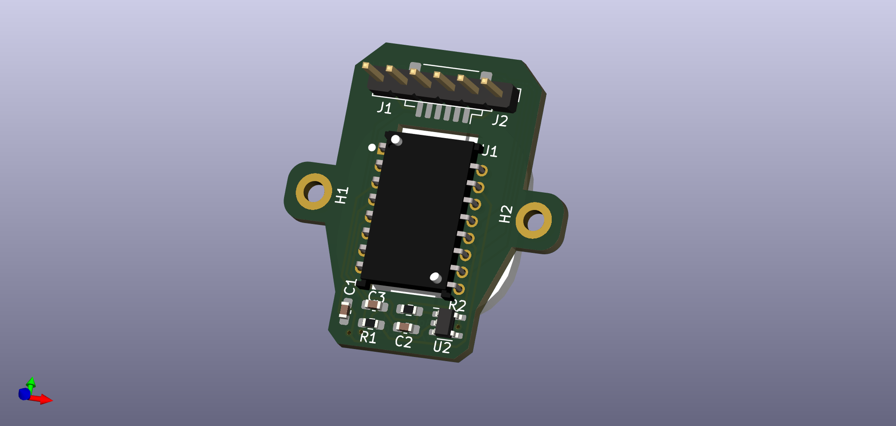

# PMW3360 Minimal Breakout Board
my version of PMW3360 breakout board from https://github.com/jfedor2/pmw3360-breakout/, I have a little space to put the breakout in so that's why the shape is weird. only work for 3.3v, Not tested yet.

